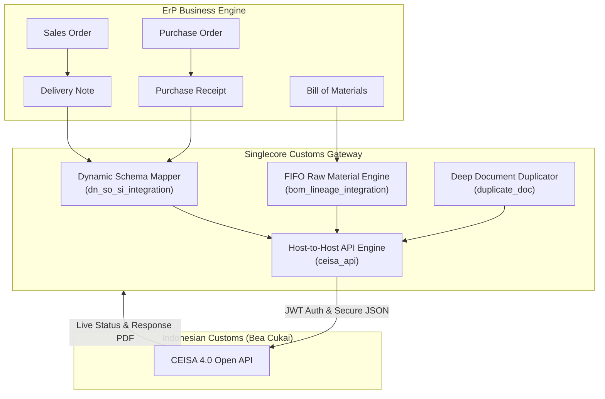

# Singlecore Customs Gateway: Bridging ERP and Compliance
*A Professional 3-Slide Presentation Deck for Singlecore Apps*
*Prepared by: Professional Presentation Consultant*

---

## 🖥️ SLIDE 1: The Border Bottleneck (Hook & Problems)
> **"In modern global trade, your cargo moves only as fast as your compliance data."**

Every minute a container sits idle at a port due to a mismatch represents real financial damage: port demurrage fees, disrupted factory lines, and damaged buyer trust. In Bonded Zones (Kawasan Berikat/TPB), compliance is not just paperwork—it is a critical logistical throughput.

### ⚠️ The Core Problems in Traditional Customs Filing

```
+--------------------------+     Manual Re-Entry     +--------------------------+
|    ERP / Business Data   |  ====================>  |    CEISA 4.0 Portal      |
|  (Sales, Shipments, BOM) |     [Error-Prone]       |   (Government Customs)   |
+--------------------------+                         +--------------------------+
```

1. **The "Double-Entry" Tax (Efficiency Loss)**
   Siloed data forces logistics clerks to manually copy dozens of fields (item codes, tariffs, quantities, packaging details) from internal ErP documents into the Indonesian Customs (CEISA 4.0) portal. This creates immense duplicate work and guarantees high transcription error rates.
2. **Subcontracting Leakage & Aging (Compliance Risk)**
   Under Bonded Zone regulations (such as BC 2.6.1 and BC 2.6.2), raw materials sent out to sub-contractors must return within strict deadlines. Standard systems fail to track **partial material returns** and remaining balances, leading to missed deadlines, tax penalties, and sudden compliance audits.
3. **The Black Box API (Operational Instability)**
   Direct Host-to-Host integration with Government APIs is notoriously fragile. Without resilient session management, connection drops, API limits (DDoS triggers), and undocumented schema changes regularly break customs filing operations, freezing logistics.

### 📊 Real-Time Direct API Status Logging in ErP
To solve the double-entry tax, the gateway logs real-time Host-to-Host Bea Cukai status events natively:


---

## 🖥️ SLIDE 2: The Unified Gateway (Insight & Solution)
> **"Compliance is not a separate department—it is the natural extension of transaction data."**

Our fundamental insight is that customs declarations (BC 4.0, BC 2.7, BC 2.3, BC 2.5, etc.) are simply transformed ERP transactions. By mapping your business lifecycle directly to the legal pabean structures, we turn manual compliance filing into an automated, background utility.

### ⚙️ 1-Click ERP Transaction Import in Action
Users can pull standard ERP documents directly into customs declarations with a single click, completely removing transcription errors:


### 🧩 The Technical Solution: Singlecore Gateway



*   **Dynamic Document Synthesizer (`HEADER V21`)**: Seamlessly parses ErP Delivery Notes, Sales Invoices, and Purchase Receipts, automatically mapping them to the multi-level `HEADER V21` customs declaration schema.
*   **BOM-Lineage & FIFO Allocator**: Auto-traces finished products back to their exact raw material roots using an active Bill of Materials (BOM) to allocate materials to outbound customs declarations.

---

## 🖥️ SLIDE 3: Engineered for Resilience (Robustness & Value)
> **"Enterprise-grade reliability is built on defensive coding and visual clarity."**

Singlecore isn't just a pipeline—it is a self-healing gateway designed to survive the realities of high-frequency customs filing and changing regulatory rules.

### 🛡️ Enterprise Robustness & Elite Features

| Feature | Dynamic Implementation | Business / Operational Value |
| :--- | :--- | :--- |
| **FIFO Subcontract Monitoring** | Dynamically calculates partial returns (`SUM(ri.qty_masuk)`) over several BC 2.6.2 documents, matching them against the original BC 2.6.1 exits. | **Zero Stock Leakage**: Displays real-time Settled, Overdue, and critical countdown (H-7) alerts on dynamic visual dashboards. |
| **Anti-DDoS Scheduler** | A background worker polls document status by `nomor_aju` using an exponential backoff algorithm to prevent spamming the CEISA endpoint. | **Government Friendly**: Prevents IP-blocking while maintaining prompt status logs and automated response captures. |
| **Real-Time PDF Dashboard** | Hybrid local-cached engine fetches Response PDFs (Draft, Final, Billing) from CEISA and displays them via beautiful, interactive status pills. | **Frictionless Logistics**: Clerks can download and print gate-pass PDFs directly from ErP with a single click. |
| **Deep-Duplication** | One-click duplication clones a complex `HEADER V21` along with all child tables. | **10x Throughput**: Eliminates manual rebuilding for repetitive bulk shipments. |

### 🖼️ Real-Time PDF Workspace & Automated Compliance Reporting
The platform integrates visual, one-click PDF actions and a robust compliance reporting suite to keep operations audit-ready:

| CEISA 4.0 PDF Workspace | 15+ Automated Customs Reports |
| :---: | :---: |
|  |  |
| *1-Click gate-pass Draft, Final, and Billing PDF downloads.* | *Mutasi, WIP, and pabean reports ensure complete audit readiness.* |

---

### 🚀 The Strategic Take-Away

*   **90% Reduction in Administrative Overhead**: Eliminates manual copy-pasting, turning customs filing into a single-click action.
*   **Flawless Audit Compliance**: Strict FIFO mapping of raw materials provides clean, unalterable inventory lineages, ensuring you pass every Bonded Zone (TPB) tax audit.
*   **Bulletproof Operational Continuity**: Self-healing API gateways with token caching and backoff safety guarantee system uptime, keeping your supply chain flowing.
